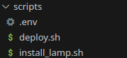

# Practica_01-03

### Despliegue de una aplicación L A M P sencilla

Para esta práctica lo que se hará será el despliegue de una aplicación web sencilla construida
a partir del codigo fuente de phpmyadmin y su base de datos integrada.

## 1. Inicial:

Primeramente empezaré configurando dentro de la una carpeta llamada *Scripts*, 2 archivos **.sh** el primero será donde se realizará lo que concierne a la instalación de la pila **LAMP** (install_lamp.sh) y el segundo para el despliegue de la **aplicación web** (deploy.sh).



### 1.1 Configuraciones iniciales:

Desde el script de *install_lamp.sh* es donde se realizarán las configuraciones iniciales, a continuación se muestra el siguiente comando para que vaya mostrando los comandos que se ejecutan:

#### Mostrar comandos:

```
set -x
```

#### Actualización de paquetes y repositorios:

Con el siguiente comando podemos realizar la actualización de la lista de paquetes:

```
dnf update -y
```

## 2. Implantación de la pila:

Para esta distribución esta vez si se llama **Apache** dicho servidor web. Con el siguiente comando se realiza la instalación del apache, y el parámetro **-y** es para que no salga la pregunta de confirmación:

```
apt install apache2 -y
```

### 2.2 Instalación de MySQL-Server:

Empleando este comando pasaré con la instalación de MySQL, y el parámetro **-y** es para que no salga la pregunta de confirmación:


```
apt install mysql-server -y
```

### 2.3 Instalación de PHP:

Empleando este comando pasaré con la instalación de **PHP**, junto a ciertos componentes que lo enlazan con el mysql, y el parámetro **-y** es para que no salga la pregunta de confirmación:

```
apt install php libapache2-mod-php php-mysql -y
```
### 2.4 Copiado del archivo .conf al apache:

Para automatizar esta tarea se puede realizar el copiado de la configuración hacia el **sites-available**:


```
cp ../conf/000-default.conf /etc/apache2/sites-available 
```
### 2.5 Copiado del archivo .index.php:

Con este comando copiamos el **index.php** que contiene el contenido sobre la versión del php hacia **/var/www/html** para que salga en el navegador a la hora de poner la ip:

```
cp ../php/index.php /var/www/html
```

### 2.5 Copiado del archivo .index.php:

Ahora le cambio el **propietario** y el **grupo** para que pueda acceder el de apache:
```
chown -R www-data:www-data /var/www/html
```

### 3. Despliegue de la aplicación sencilla:

Desde el otro *script* llamado **deploy.sh** comezaré realizando un borrado de las descargas previas:

```
rm -rf /tmp/iaw-practica-lamp
```

Seguidamente se puede pasar a realizar una clonación del codigo fuente de la aplicación y se arroja hacia la carpeta temporal:

```
git clone https://github.com/josejuansanchez/iaw-practica-lamp.git /tmp/iaw-practica-lamp
```
seguidamente, indicando el **"*"** al final de la ruta, muevo todo lo que hay en el **/src** hacia **/var/www/html**

```
mv /tmp/iaw-practica-lamp/src/* /var/www/html
```
### 3.1 Configuración de archivo config.php de la app:

Mediante los siguientes 3 comandos busco y reemplazo las cadenas por las variables que llamo del **.env**:
```
sed -i "s/database_name_here/$DB_NAME/" /var/www/html/config.php
------------------------------------------------
sed -i "s/username_here/$DB_USER/" /var/www/html/config.php
------------------------------------------------
sed -i "s/password_here/$DB_PASSWORD/" /var/www/html/config.php
```

En cuanto al script de la base de datos podemos estar reemplezando la cadena **"lamp"** por el valor de la variable **$DB_NAME**

```
sed -i "s/lamp_db/$DB_NAME/" /tmp/iaw-practica-lamp/db/database.sql
```
### 3.2 Importado del script de base de datos

Tras haberlo configurado de forma automatizada, mediante **"<"** le indico que la acción de entrada es el archivo ya configurado de la base de datos:

```
mysql -u root < /tmp/iaw-practica-lamp/db/database.sql
```
### 3.3 Creación de los usuarios con los privilegios


```
mysql -u root <<< "DROP USER IF EXISTS '$DB_USER'@'%'"
------------------------------------------
mysql -u root <<< "CREATE USER '$DB_USER'@'%' IDENTIFIED BY '$DB_PASSWORD'"
------------------------------------------
mysql -u root <<< "GRANT ALL PRIVILEGES ON $DB_NAME.* TO '$DB_USER'@'%'"
```
